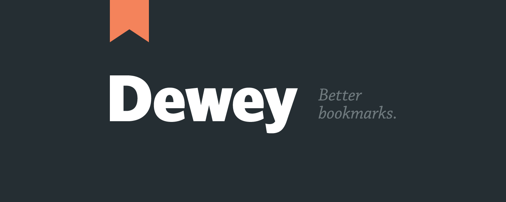
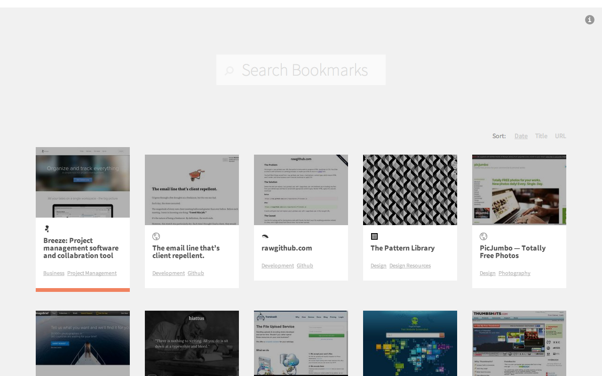
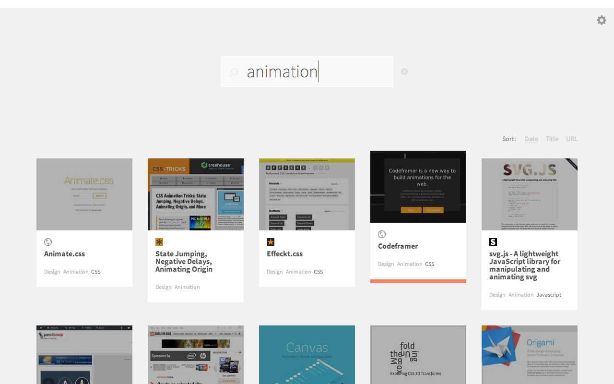
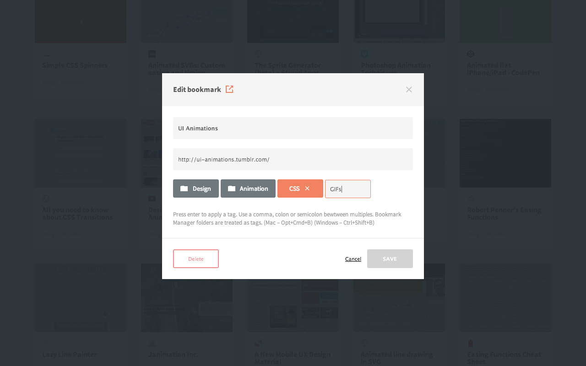
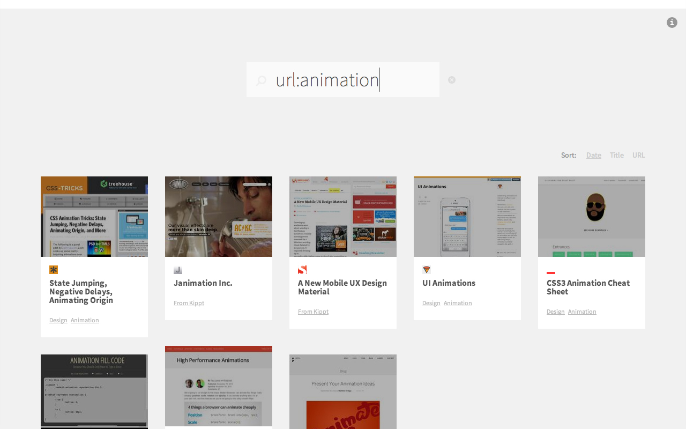
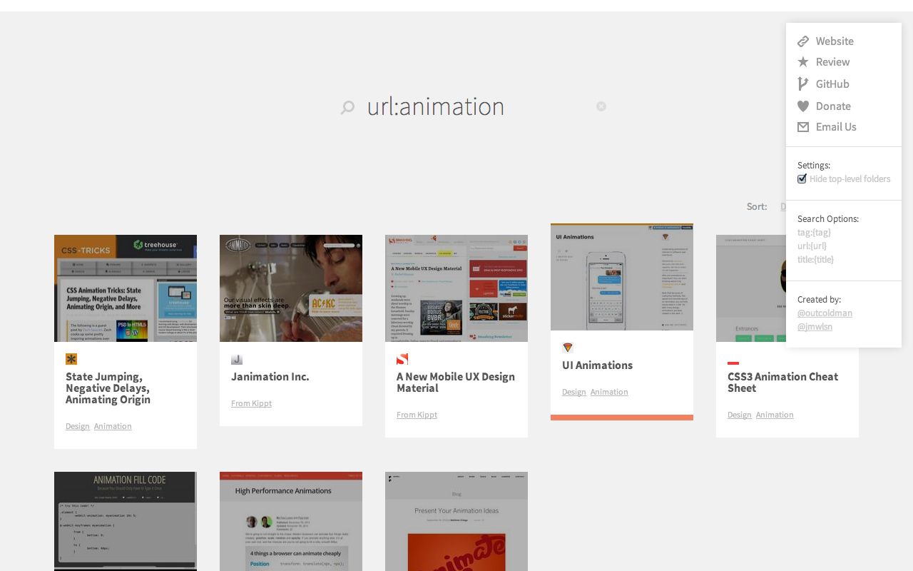
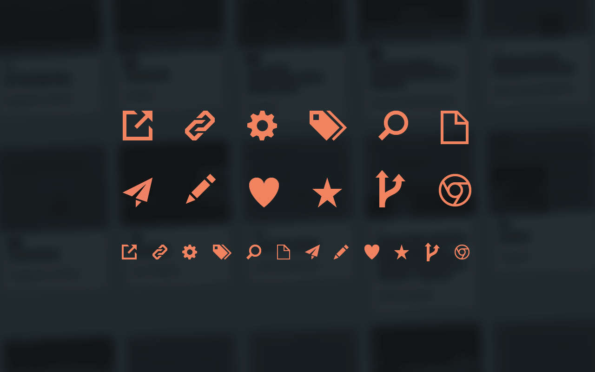

# Dewey. Better Chrome Bookmarks.

####Dewey is a [Chrome app](https://chrome.google.com/webstore/detail/bookmarks/aahpfefkmihhdabllidnlipghcjgpkdm) that adds custom tags, screenshots, and smarter search to your Chrome bookmarks. Created by [@outcoldman](https://github.com/outcoldman) and [@jamiewilson](https://github.com/jamiewilson).
  
  
  
With Dewey you can:

- Search your bookmarks quickly by keyword
- Search by Title, Tag, or URL by using one or more of the search operators. e.g. `tag:blogs` would only return bookmarks tagged `blogs`.
- Sort your bookmarks and your search results by Date, Title, or URL
- Use the Left/Right/Tab keyboard keys to navigate through the grid of bookmarks.
- When one of you bookmarks is highlighted, hit enter to visit the link.
- Click the Title of the bookmark to open the edit panel.
- Dewey treats folders in Chrome's Bookmark Manager as tags. To edit those you'll need to go to your Bookmark Manager.
- You can also add custom tags only visibile to Dewey.
- If you'd like Dewey to ignore Chrome's top-level folders (Bookmarks Bar, Other Bookmarks and Mobile Bookmarks) click the Info icon in the top right corner and check the "Hide top-level folders" box

Dewey organizes your bookmarks into a grid that continues to load as you scroll down. The layout is also fully responsive, so it still works well even if you need to use a narrow browser window.

You can use the arrow or tab keys to navigate through your bookmarks. Hit enter to launch the selected link.

Clicking on the Title of a bookmark will bring up this edit window where you can edit the title, url and add custom tags. You can also delete a bookmark from Chrome.

There are several ways to search your bookmarks with Dewey:

1. A standard search returns anything with that word in the Tag, Title or URL.
2. Add `tag:` before a word to limit results that have that specific tag applied.
3. Add `title:` before a word to limit results to titles that contain that word.
4. Add `url:` before a word to limit results to URLs that contain that word.

There is also an option for Dewey to ignore Chrome Bookmarks top-level folders. Dewey will treat these folders as tags, but since Chrome's default is to put all bookmarks saved from your browser into "Other Bookmarks", we thought you might like Dewey to ignore those altogether.

## Install on the Chrome Web Store

## Get Help or Contribute

####Please [submit issues, bugs, improvements, feature requests, etc.](https://github.com/deweyapp/deweyapp/issues) in the Github Issues section of this project.

Or [fork the repo and create your own features](https://github.com/deweyapp/deweyapp/fork). Send us a pull request and we'll be thrilled to review and integrate. But only if it's awesome.

## Donate
We made Dewey in our spare time because it's fun to build things. We aren't doing it for money.

But, if you like Dewey and want to support future development—or just say thank you, please consider making a donation of $5, $10 or $20 (or whatever you can afford) to help us continue to improve it.

## Creators
###Denis Gladkikh - Development

- [http://outcoldman.com](http://outcoldman.com)
- [https://twitter.com/outcoldman](https://twitter.com/outcoldman)
- [https://github.com/outcoldman](https://github.com/outcoldman)

###Jamie Wilson - Design

- [Portfolio - jamiewilson.io](http://jamiewilson.io)
- [Twitter - @jmwlsn](https://twitter.com/jmwsln)
- [github.com/jamiewilson](https://github.com/jamiewilson)

##Icons
All icons used in this application are released to the public with No Copyright (CC0 1.0 Universal (CC0 1.0) Public Domain Dedication). 

Feel free to use these icons for whatever you want. But if you'd like to help us out, any attribution and/or reference to Dewey would be greatly appreciated.
###[Download](link.com) - one Adobe Illustrator file with all icons

## Dewey was built with…
To build this application we used following Open Source libraries and resources:

- [Bootstrap](http://getbootstrap.com/) - Small section used for dropdown & modal
- [jQuery](https://jquery.org)
- [AngularJS](http://angularjs.org/)
- [UnderscoreJS](http://underscorejs.org/)
- [RequireJS](http://requirejs.org/)
- [UI Bootstrap](http://angular-ui.github.io/bootstrap/) - Custom build with patch for Modal dialog (from branch _bootstrap3_bis2_modalPatch_)
- [bootstrap-tagsinput](http://timschlechter.github.io/bootstrap-tagsinput/examples/bootstrap3/) - With small modification of `bootstrap-tagsinput-angular`

## License
  Apache License, Version 2.0

***
  
### Changelog
- 1.1.2 (October 30 2013) - Use bookmarks url as identity instead of id (each chrome installation has it is own identities). Chrome storage has limitation on item size, changed the way I store custom tags in storage, split it by chunks.
- 1.1.1 (October 29 2013) - Fix issue #1.
- 1.1 (October 28 2013) - Updated bookmark edit dialog with options to edit title, custom tags and delete bookmark.
- 1.0 (October 13 2013) - Ready for use first version of application in Chrome Web Store.
- 0.1 (September 27 2013) - First prototype on [Seattle Google Developer Groups Dev Fest 2013](http://www.meetup.com/seattle-gdg/events/125948972/). ([second place](http://www.flickr.com/photos/pahphotos/10015447933/))

