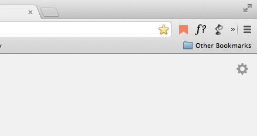
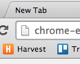
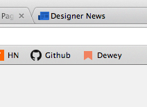
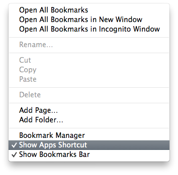
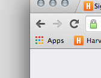
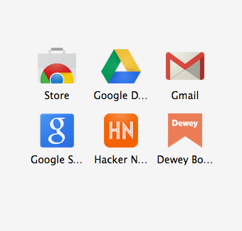
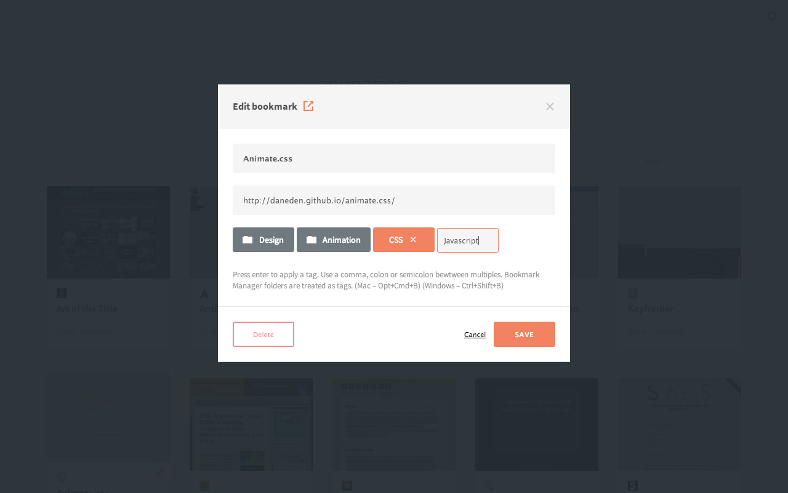

#How to use Dewey
- [Installing](#installing)
- [Launching](#launching)
- [Navigating](#navigating)
- [Searching / Sorting](#search)
- [Editing](#editing)
- [Tagging](#tagging)
- [Options](#options)

# [Installing](id:installing)
## via Chrome Web Store

You can also add Dewey to Chrome directly from our website, [deweyapp.io](http:/deweyapp.io).

# [Launching](id:launching)

There are several ways to open Dewey.

##1. Dewey Launcher
We highly recommend [Dewey Launcher](https://chrome.google.com/webstore/detail/dewey-launcher/fnfpnjjgpfifiilkencadlekjebpmbph), a small companion extension that puts a Dewey Icon in your browser next to the omnibox (i.e. the search bar) to quickly launch Dewey.

##2.  Put Dewey in your Bookmarks Bar
Make sure your [Bookmarks Bar](https://support.google.com/chrome/answer/95745?hl=en0) is visible. With Dewey open, drag the little document icon in the Search Bar onto the Bookmarks Bar. This is my preferred method. 

##3.  Go to your Apps Page
You can simply enter `chrome://apps` in the search box and hit enter.

**OR:**

Right click your bookmarks bar (if it's not visible, press Cmd+Shift+B):

  

Selecting Show Apps Shortcut will put this in your bookmarks bar:

Clicking this will take you too Chrome's App page which shows you all your apps, like this:

# [Navigating](id:navigating)

- Use the Left/Right/Tab keyboard keys to navigate through the grid of bookmarks.
- When one of you bookmarks is highlighted, hit enter to visit the link.

# [Searching / Sorting](id:search)
There are several ways to search your bookmarks with Dewey:

- A standard search returns anything with that word in the Tag, Title or URL.
- Add `tag:` before a word to limit results that have that specific tag applied.
- Add `title:` before a word to limit results to titles that contain that word.
- Add `url:` before a word to limit results to URLs that contain that word.
- Sort your bookmarks and your search results by Date, Title, or URL
- Clicking a tag on a bookmark will run search of that tag

# [Editing](id:editing)
- Clicking the Title of a bookmark opens the edit window.
- Within the edit window you can edit the Title, URL and custom tags
- You can also delete a bookmark from Chrome.

# [Tagging](id:tagging)

- Dewey treats folders in your Chrome Bookmark Manager as tags. To edit those you'll need to go to your Bookmark Manager. (Mac – Opt+Cmd+B) (Windows – Ctrl+Shift+B)

# [Options](id:options)
There are two options for Dewey. 

####1. Hide Top-level Folders
If you’d like Dewey to ignore Chrome’s top-level folders (i.e., Bookmarks Bar, Other Bookmarks and Mobile Bookmarks) click the Settings icon in the top right corner and check the “Hide top-level folders” box.

####2. Show Thumbnails
If you want Dewey to generate thumbnails for your bookmarks, enable or disable the feature here. If you decide not to show thumbnails, the color of your bookmark will be created from the colors within the link's favicon.